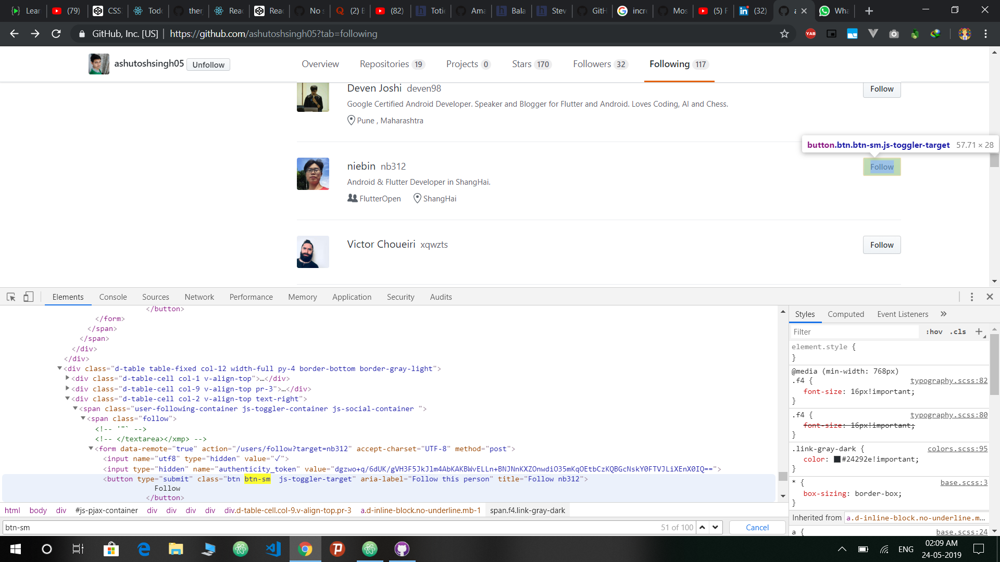
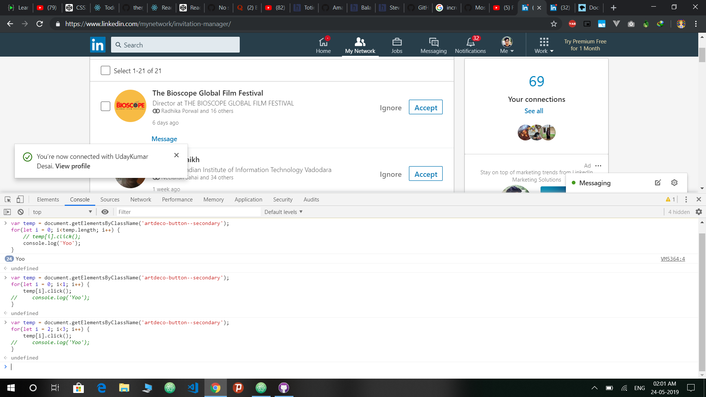

<p align="center"></p>
<h1 align="center">Accept multiple requests at once</h1>

I recently wanted to follow everyone whom my friends follow. But it was quite boring to go through the list and click on the `Follow` button. So I decided to do something like this.

### Follow multiple GitHub users at once

- Go to `Inspect` in your browser
- Go to the **Followers** page
- Run this command on console

```javascript
var temp = document.getElementsByClassName('btn-sm');
for(let i = 0; i<temp.length; i+=2) {
    temp[i].click();
}
```



### Accepting multiple connections on LinkedIn
- Go to `Inspect` in your browser
- Go to the **My Network** page
- Run this command on console

```javascript
var temp = document.getElementsByClassName('artdeco-button--secondary');
for(let i = 0; i<temp.length; i++) {
    temp[i].click();
}
```



## Thanks for reading 😄

## Author
[Aman Raj](https://github.com/amanraj1608)

[](https://linkedin.com/in/amanraj1608)
[](https://www.instagram.com/amanraj1608/)
[](https://twitter.com/amanraj1608)
